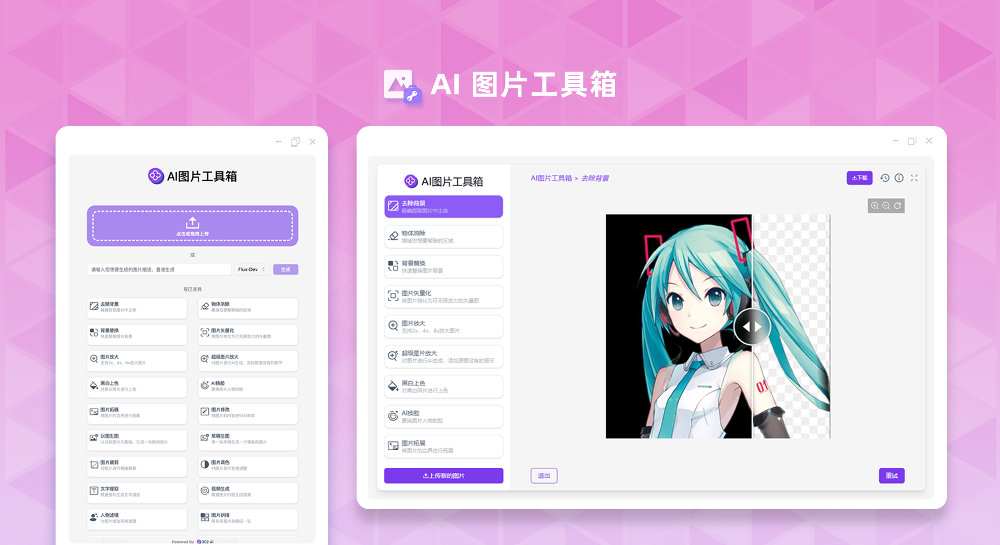

# <p align="center">🖼️ AI 图片工具箱 🚀✨</p>

<p align="center">AI图片工具箱提供了各种丰富的AI处理图片功能，还可以连续进行链式操作。</p>

<p align="center"><a href="https://302.ai/product/detail/29" target="blank"></a></p >

  

这是来自[302.AI](https://302.ai)的[AI图片工具箱](https://302.ai/product/detail/29)开源版本。你可以直接登录302.AI，零代码零基础使用在线版本，或根据自己的需求修改并自行部署。

## 界面预览
可通过上传图片或输入描述，选择模型生成图片后进行图片处理，多种图片处理功能可供选择。
      

以去除背景功能为例，根据上传的图片，AI自动识别背景并去除。


## 项目特性
### 🎥 AI图片工具箱
  支持多种图片操作，包括拓展功能文字生图跟图片转视频。
### 🖼️ 功能一应俱全
  包括去除背景、物体消除、背景替换、图片矢量化、图片放大、超级图片放大、黑白图片上色、AI换脸、图片扩展、图片修改、以图生图、草稿生图、图片裁剪、图片调色、图片拼接、人物滤镜等功能。
### 🔄 任务管理
  任务支持重新生成，链式调用各种工具，历史回滚再次编辑。
### ⚙️ 多模型支持
  可选择各种模型生成图片跟视频。
### 📜 历史记录
  保存您的创作历史,记忆不丢失，随时随地都可以下载。
### 🌍 多语言支持
  - 中文界面
  - English Interface
  - 日本語インターフェース

## 🚩 未来更新计划
- [ ] 新增特效、图像修复、图像合成等功能

## GitHub Actions

本项目使用GitHub Actions自动化处理各种任务：

- **PR阅读时间估算**：自动估算PR的审查时间，帮助团队更好地安排代码审查
- **代码同步**：自动将代码同步到CNB平台
- **提交检查**：自动检查提交信息的规范性
- **构建、签名并发布 Docker 镜像**：在 PR 合并到 main 分支时或创建 Git 标签时自动构建 Docker 镜像，使用 Cosign 进行签名，并创建 GitHub Release（正式发布）

有关 Docker 镜像构建与签名的详细信息，请参阅 [Docker 镜像构建与签名指南](docs/docker-image-signing.md)。

## 技术栈

- Next.js 14 基础框架
- Tailwind CSS + Shadcn UI 样式UI
- Zustand 作为数据管理
- React Konva 用于图像编辑画布
- React Query 用于数据获取和缓存
- TypeScript 用于类型安全

## 环境要求

- Node.js >= 18（推荐 v20）
- npm @10.1.0
- Docker（用于生产构建）
- TypeScript 编译支持（VSCode 或其他 IDE）

有关 Windows 环境下的详细配置指南，请参阅 [Windows 开发环境配置](docs/windows-development.md)。

## 配置说明

在运行项目之前，您需要配置环境变量。请参考 [.env.example](.env.example) 文件创建您的 `.env` 文件：

```bash
# 复制环境变量模板
cp .env.example .env
```

然后在 `.env` 文件中填写您的 302.AI API 密钥：

```env
NEXT_PUBLIC_API_KEY="sk-xxx" 
NEXT_PUBLIC_FETCH_API_URL=https://api.302.ai
NEXT_PUBLIC_UPLOAD_API_URL=https://dash-api.proxy302.com/gpt/api/upload/gpt/image
```

## 开发&部署

### 开发环境

1. 克隆项目 `git clone git@github.com:302ai/302_image_toolbox.git`
2. 安装依赖 `npm install`
3. 配置302的API KEY 参考.env.example
4. 运行项目 `npm run dev`
5. 在浏览器中访问 `http://localhost:3000`

### 生产部署

#### 使用 Docker (推荐)

``bash
# 构建镜像
docker build -t image-toolbox .

# 运行容器
docker run -p 3000:3000 image-toolbox
```


#### 直接部署

```bash
# 安装依赖
npm install

# 构建生产版本
npm run build

# 启动服务
npm start
```

## 目录结构

```
.
├── .github
│   ├── labeler.yml                 # 标签配置文件
│   └── workflows                   # GitHub Actions工作流配置
│       ├── badgetizr.yml           # 徽章生成
│       ├── build-and-sign.yml      # 构建、签名并发布 Docker 镜像
│       ├── codeql.yml              # 代码安全检查
│       ├── commit-check.yml        # 提交检查
│       ├── greetings.yml           # 新贡献者欢迎
│       ├── label.yml               # 自动标签
│       ├── pr-reading-time.yml     # PR阅读时间估算
│       ├── summarize-issues.yml    # 问题摘要
│       └── sync-to-coding.yml      # 代码同步到CNB平台
├── docs                            # 文档目录
│   ├── docker-image-signing.md     # Docker 镜像构建与签名指南
│   ├── zh                          # 中文文档
│   │   ├── pic-tool.png            # 界面预览图
│   │   └── 图片工具箱1.png         # 功能示例图
│   ├── AI图像描述生成功能开发文档.md
│   ├── AI图像风格迁移功能开发文档.md
│   ├── GiteeAI模型集成开发文档.md
│   ├── 人脸美化功能开发文档.md
│   ├── 动态特效生成功能开发文档.md
│   ├── 图像对比度增强功能开发文档.md
│   ├── 图像格式智能转换功能开发文档.md
│   ├── 图像纹理分析功能开发文档.md
│   ├── 图像色彩分析功能开发文档.md
│   ├── 图像质量评估功能开发文档.md
│   ├── 图像边缘增强功能开发文档.md
│   ├── 批量图像处理功能开发文档.md
│   ├── 新增功能路线图.md
│   ├── 方舟模型集成开发文档.md
│   ├── 智能图像修复功能开发文档.md
│   ├── 智能图像去噪功能开发文档.md
│   ├── 智能图像去雾功能开发文档.md
│   ├── 智能图像合成功能开发文档.md
│   ├── 智能图像增强功能开发文档.md
│   ├── 智能抠图功能开发文档.md
│   ├── 智能水印添加功能开发文档.md
│   ├── 百度千帆模型集成开发文档.md
│   ├── 艺术风格转换功能开发文档.md
│   ├── 超分辨率重建功能开发文档.md
│   ├── 阿里万相模型集成开发文档.md
│   └── 阿里云百煉模型集成开发文档.md
├── public                          # 静态资源
│   ├── banner.png                  # 横幅图片
│   ├── icon.ico                    # 网站图标
│   ├── logo.png                    # Logo图片
│   ├── next.svg                    # Next.js图标
│   ├── vercel.svg                  # Vercel图标
│   └── images                      # 其他图片资源
├── src                             # 源代码目录
│   ├── app                         # Next.js应用路由
│   │   ├── _component              # 页面组件
│   │   │   ├── auth.tsx            # 认证组件
│   │   │   ├── edit.tsx            # 编辑页面组件
│   │   │   └── land.tsx            # 首页组件
│   │   ├── favicon.ico             # 网站图标
│   │   ├── globals.css             # 全局样式
│   │   ├── layout.tsx              # 布局组件
│   │   └── page.tsx                # 主页
│   ├── components                  # React组件
│   │   ├── image-editor            # 图像编辑器组件
│   │   │   ├── components          # 编辑器子组件
│   │   │   ├── icons               # 编辑器图标组件
│   │   │   ├── index.tsx           # 编辑器入口文件
│   │   │   ├── photo.jpeg          # 示例图片
│   │   │   └── styles.scss         # 编辑器样式
│   │   ├── ui                      # UI基础组件
│   │   ├── Image-mask.tsx          # 图像遮罩组件
│   │   ├── Image-uncropper.tsx     # 图像取消裁剪组件
│   │   ├── alert-bar.tsx           # 警告栏组件
│   │   ├── canvas.tsx              # 画布组件
│   │   ├── character-modal.tsx     # 角色模态框组件
│   │   ├── confirm-modal.tsx       # 确认模态框组件
│   │   ├── descript-modal.tsx      # 描述模态框组件
│   │   ├── drop-zone.tsx           # 拖拽区域组件
│   │   ├── footer.tsx              # 页脚组件
│   │   ├── history-content.tsx     # 历史内容组件
│   │   ├── history-modal.tsx       # 历史模态框组件
│   │   ├── image-compare.tsx       # 图像对比组件
│   │   ├── image-cropper.tsx       # 图像裁剪组件
│   │   ├── image-stitching.tsx     # 图像拼接组件
│   │   ├── image-transfer.tsx      # 图像传输组件
│   │   ├── image-viewer.tsx        # 图像查看器组件
│   │   ├── lang-menu.tsx           # 语言菜单组件
│   │   ├── lang-selecter.tsx       # 语言选择器组件
│   │   ├── loading.tsx             # 加载组件
│   │   ├── md-content.tsx          # Markdown内容组件
│   │   ├── md-modal.tsx            # Markdown模态框组件
│   │   ├── model-selecter.tsx      # 模型选择器组件
│   │   ├── my-icon.tsx             # 自定义图标组件
│   │   ├── nav.tsx                 # 导航组件
│   │   ├── prompt-bar.tsx          # 提示栏组件
│   │   ├── ratio-bar.tsx           # 比例栏组件
│   │   ├── ratio-modal.tsx         # 比例模态框组件
│   │   ├── scale-bar.tsx           # 缩放栏组件
│   │   ├── side-sheet.tsx          # 侧边栏组件
│   │   ├── size-bar.tsx            # 尺寸栏组件
│   │   ├── size-modal.tsx          # 尺寸模态框组件
│   │   ├── tool-card.tsx           # 工具卡片组件
│   │   ├── upload-bar.tsx          # 上传栏组件
│   │   ├── upload-button.tsx       # 上传按钮组件
│   │   ├── upload-file.tsx         # 上传文件组件
│   │   ├── upload-images.tsx       # 上传图片组件
│   │   ├── video-player.tsx        # 视频播放器组件
│   │   └── zoom-box.tsx            # 缩放框组件
│   ├── constants                   # 常量定义
│   │   └── index.tsx               # 常量入口文件
│   ├── lib                         # 工具库和API封装
│   │   ├── api.ts                  # API接口封装
│   │   └── utils.ts                # 工具函数
│   ├── locales                     # 多语言资源
│   │   ├── en.ts                   # 英文语言包
│   │   ├── index.ts                # 语言包入口文件
│   │   ├── ja.ts                   # 日文语言包
│   │   └── zh.ts                   # 中文语言包
│   ├── stores                      # Zustand状态管理
│   │   ├── index.ts                # 状态管理入口文件
│   │   └── slices                  # 状态切片
│   │       └── configSlice.ts      # 配置状态切片
│   ├── types                       # TypeScript类型定义
│   │   └── index.ts                # 类型定义入口文件
│   └── utils                       # 工具函数
│       ├── Image.ts                # 图像处理工具
│       ├── Storage.ts              # 存储工具
│       └── System.ts               # 系统工具
├── .env.example                    # 环境变量示例文件
├── .eslintrc.json                  # ESLint配置文件
├── .gitignore                      # Git忽略文件配置
├── Dockerfile                      # Docker配置文件
├── LICENSE                         # 开源许可证
├── README.md                       # 项目说明文档
├── components.json                 # 组件配置文件
├── ecosystem.config.cjs            # PM2配置文件
├── install_gpg_keys.sh             # GPG密钥安装脚本
├── next.config.mjs                 # Next.js配置
├── package.json                    # 项目依赖和脚本
├── postcss.config.mjs              # PostCSS配置
├── tailwind.config.ts              # Tailwind CSS配置
└── tsconfig.json                   # TypeScript配置
```

## ✨ 302.AI介绍 ✨

[302.AI](https://302.ai)是一个面向企业的AI应用平台，按需付费，开箱即用，开源生态。✨

1. 🧠 集合了最新最全的AI能力和品牌，包括但不限于语言模型、图像模型、声音模型、视频模型。
2. 🚀 在基础模型上进行深度应用开发，我们开发真正的AI产品，而不是简单的对话机器人。
3. 💰 零月费，所有功能按需付费，全面开放，做到真正的门槛低，上限高。
4. 🛠 功能强大的管理后台，面向团队和中小企业，一人管理，多人使用。
5. 🔗 所有AI能力均提供API接入，所有工具开源可自行定制（进行中）。
6. 💡 强大的开发团队，每周推出2-3个新应用，产品每日更新。有兴趣加入的开发者也欢迎联系我们。
```
